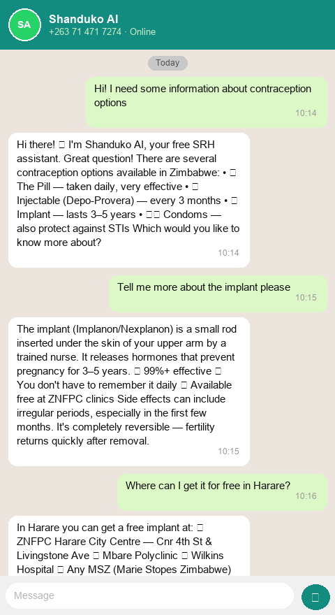
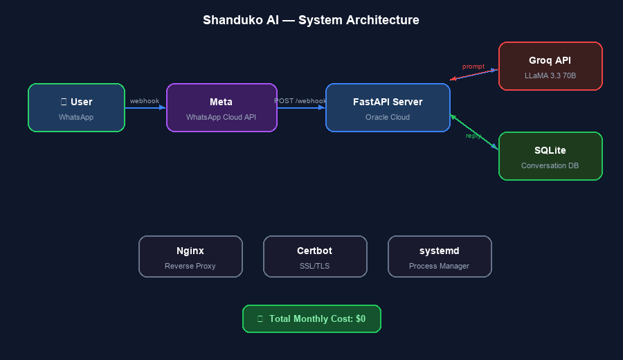

# Shanduko AI

> A free WhatsApp-based sexual and reproductive health (SRH) assistant for young people in Zimbabwe

[](https://wa.me/263714717274)
[](https://python.org)
[](https://fastapi.tiangolo.com)
[](https://groq.com)
[](https://developers.facebook.com/docs/whatsapp)
[](https://cloud.oracle.com)

---

## Try It Now

Message **Shanduko AI** directly on WhatsApp:

**[+263 71 471 7274](https://wa.me/263714717274)**

No app download. No sign-up. Just message and get answers.

---

## Screenshots

### WhatsApp Conversation


### Architecture


---

## About

**Shanduko** means *"change"* in Shona — this bot exists to create positive change through accurate, judgment-free sexual and reproductive health information.

Shanduko AI was originally pitched at the **Imperial College London AI Health Innovation Workshop (2025)**, where it placed second runner-up. It has since been built into a fully deployed, production-ready service.

Zimbabwe has one of the highest rates of teenage pregnancy in Africa, with limited access to youth-friendly SRH information, especially in rural and peri-urban areas. Shanduko AI bridges that gap — free, private, available 24/7 on the phone every young Zimbabwean already has.

---

## Features

| Feature | Description |
|---------|-------------|
| SRH Q&A | Answers questions on contraception, STIs, pregnancy, menstrual health, consent |
| Context Memory | Remembers conversation history within a session for natural follow-up questions |
| Crisis Support | Detects distress and responds with Zimbabwe crisis hotlines |
| Privacy First | No names, no profiles — only phone number used to route replies |
| Conversation Reset | Send `reset` at any time to erase your history |
| 24/7 Availability | Runs continuously on Oracle Cloud with systemd process management |
| Free to Use | Zero cost for users — no data charges beyond normal WhatsApp usage |

---

## Architecture

```
User (WhatsApp)
      │
      ▼
Meta WhatsApp Cloud API
      │  webhook POST /webhook
      ▼
FastAPI Server (Oracle Cloud · shanduko.duckdns.org)
      │
      ├──▶ SQLite (conversation history)
      │
      └──▶ Groq API (LLaMA 3.3 70B)
                │
                ▼
           AI Response
                │
                ▼
Meta WhatsApp Cloud API ──▶ User (WhatsApp)
```

**Infrastructure:**
- Server: Oracle Cloud VM (Ubuntu 22.04) — free tier
- Domain: `shanduko.duckdns.org` (DuckDNS free domain)
- SSL: Let's Encrypt via Certbot
- Reverse Proxy: Nginx
- Process Manager: systemd (`shanduko.service`)
- AI Model: `llama-3.3-70b-versatile` via Groq (free tier)
- Messaging: Meta WhatsApp Cloud API (free under 1,000 conversations/month)

**Total monthly cost: $0**

---

## Tech Stack

| Layer | Technology |
|-------|-----------|
| Backend | Python 3.11, FastAPI, Uvicorn |
| AI Engine | Groq API — LLaMA 3.3 70B Versatile |
| Messaging | Meta WhatsApp Cloud API |
| Database | SQLite |
| Server | Oracle Cloud Infrastructure (Free Tier) |
| Reverse Proxy | Nginx + SSL (Let's Encrypt) |
| Process | systemd service |

---

## Project Structure

```
shanduko-ai/
├── main.py            # FastAPI app — webhook handler
├── ai_engine.py       # Groq LLM integration + system prompt
├── whatsapp.py        # Meta WhatsApp API client
├── database.py        # SQLite conversation history
├── config.py          # Environment variable loading
├── requirements.txt   # Python dependencies
├── .env.example       # Environment variable template
├── screenshots/       # Demo screenshots
├── index.html         # GitHub Pages homepage
└── privacy.html       # Privacy policy (Zimbabwe DPA 2021 compliant)
```

---

## Setup (Self-Hosting)

### Prerequisites
- Python 3.11+
- A Meta Developer account with a WhatsApp Business app
- A Groq API key (free at [console.groq.com](https://console.groq.com))
- A public HTTPS server (ngrok for local dev, or a VPS)

### 1. Clone and Install

```bash
git clone https://github.com/CyprianTinasheMasvikeni/shanduko-ai.git
cd shanduko-ai
pip install -r requirements.txt
```

### 2. Configure Environment

```bash
cp .env.example .env
# Edit .env with your keys
```

```env
WHATSAPP_TOKEN=your_meta_system_user_token
WHATSAPP_PHONE_NUMBER_ID=your_phone_number_id
VERIFY_TOKEN=your_custom_verify_token
GROQ_API_KEY=your_groq_api_key
```

### 3. Run Locally

```bash
uvicorn main:app --reload --port 8001
```

For local testing with a public URL:
```bash
ngrok http 8001
```
Set the ngrok URL as your Meta webhook: `https://your-ngrok-url/webhook`

### 4. Production Deployment (Ubuntu VPS)

```bash
# Install as systemd service
sudo nano /etc/systemd/system/shanduko.service
sudo systemctl enable shanduko
sudo systemctl start shanduko

# Set up nginx reverse proxy on port 8001
# Configure SSL with certbot
```

---

## How the Bot Works

1. User sends a WhatsApp message to +263 71 471 7274
2. Meta's servers POST the message to `/webhook` on our FastAPI server
3. The message is saved to SQLite with the user's phone number
4. Last 10 messages of conversation history are retrieved
5. Groq's LLaMA 3.3 70B model generates a contextual SRH response
6. The response is sent back via the WhatsApp Cloud API
7. The AI reply is saved to SQLite

---

## Roadmap

| Phase | Feature | Status |
|-------|---------|--------|
| Phase 1 | Core SRH Q&A chatbot | ✅ Live |
| Phase 1 | Conversation memory | ✅ Live |
| Phase 1 | Crisis detection + hotlines | 🔄 In progress |
| Phase 2 | Structured topic menu (HIV, contraception, pregnancy, STIs) | 📋 Planned |
| Phase 2 | Analytics dashboard — usage patterns for public health research | 📋 Planned |
| Phase 3 | Shona and Ndebele language support | 📋 Planned |
| Phase 3 | Zimbabwe clinic locator | 📋 Planned |
| Phase 4 | Healthcare worker referral system | 📋 Planned |
| Phase 4 | Age-appropriate content tiers | 📋 Planned |

---

## Privacy & Compliance

- Privacy Policy: [cypriantinashemasvikeni.github.io/shanduko-ai/privacy.html](https://cypriantinashemasvikeni.github.io/shanduko-ai/privacy.html)
- Compliant with the **Zimbabwe Data Protection Act (Chapter 11:22, 2021)**
- No data sold or shared with advertisers
- Conversation history auto-deleted after 30 days
- Users can delete their data instantly by sending `reset`

---

## Research & Partnerships

Shanduko AI is designed with a public health research layer in mind. Anonymised, aggregated data (topic distribution, usage frequency) can support:
- Zimbabwe Ministry of Health SRH programme evaluation
- UNFPA / UNICEF youth health initiative reporting
- Academic research on digital SRH intervention effectiveness

For partnership and research enquiries: [tynashmasvikeni@gmail.com](mailto:tynashmasvikeni@gmail.com)

---

## License

MIT License — free to use, fork, and adapt for non-commercial public health purposes.

---

## Author

**Cyprian Tinashe Masvikeni**  
Public Health Advocate & Software Developer  
Harare, Zimbabwe  

[](https://github.com/CyprianTinasheMasvikeni)
[](mailto:tynashmasvikeni@gmail.com)

---

*"Shanduko" — Shona for "change". One conversation at a time.*
